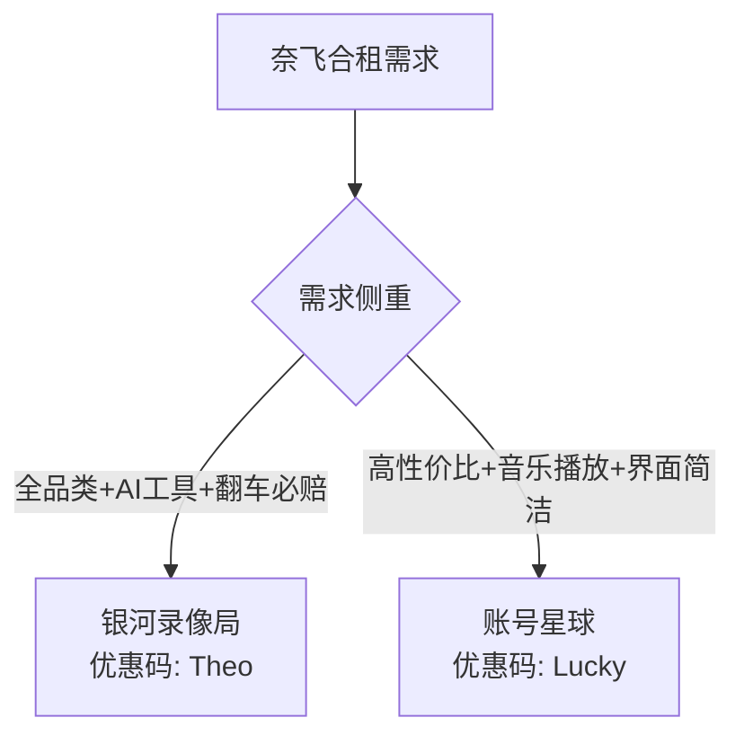

# 2026 奈飞(Netflix)账号合租与购买防封指南：银河录像局 vs 账号星球 vs 环球巴士对比

作为全球品质最高、无广告的影视流媒体平台，**奈飞 (Netflix)** 拥有《黑镜》、《怪奇物语》、《鱿鱼游戏》等大量顶级独播剧集。然而，官方 Netflix Premium 4K 套餐单独订阅价格高昂（每月约 \$20 美元，折合人民币超 140 元），且需要海外信用卡支付。

因此，**“奈飞账号合租拼车”** 成为了国内最受欢迎的性价比追剧方案——每月仅需不到 15~20 元，即可独享 4K HDR 最高画质观影车位。

随着 Netflix 官方推行严格的“同户装置（Household）”限制，个人私下拼车极易出现“无法在电视端播放”或“账号封锁”的问题。选择正规商业化的**奈飞合租平台**（如 **银河录像局**、**账号星球** 等）成为了安全保障的首选。

---

## 🔍 奈飞合租两大主流平台深度对比

根据服务稳定性、同户限制处理能力、客服响应速度及价格，我们对市面上最热门的两大合租平台进行了对比：

### 1. 银河录像局（全品类大厂，首选推荐 ⭐⭐⭐⭐⭐）

**银河录像局** 是国内规模最大的海外流媒体与 AI 账号合租平台之一。

- **奈飞合租特色**：
  - 提供 **Netflix 独立 Profile + 专属 PIN 码** 隔离，观看历史与推荐算法互不干扰；
  - 针对 Netflix 同户装置限制，提供**自动化验证码接收与一键解锁验证**功能；
  - 提供 **“翻车必赔”** 售后服务，账号异常自动秒换新号；
  - 支持 **ChatGPT Plus、Claude 3.5、Disney+、YouTube Premium** 全套合租。
- **专属优惠码**：结账输入 `Theo` 享全站 **95 折** 优惠。
- **评测详情**：[银河录像局深度评测与优惠码使用指南](/account/yinheluxiangju.html)。

### 2. 账号星球（高性价比清爽平台 ⭐⭐⭐⭐⭐）

**账号星球 (Account Planet)** 主打极简无广告与超高性价比。

- **奈飞合租特色**：
  - 奈飞 Premium 4K 车位定价低于市场平均水平；
  - 在 **Spotify Premium、YouTube Premium、Apple Music** 音频品类上价格极其亲民；
  - 自动发号，支付宝/微信秒付款。
- **专属优惠码**：结账输入 `Lucky` 享全站 **9 折** 优惠。
- **评测详情**：[账号星球深度评测与优惠码 Lucky 指南](/account/zhanghaoxingqiu.html)。

---

## 📊 2026 奈飞合租平台价格与折扣对比表

| 合租平台 | Netflix 4K 月均价格 | 专属优惠码 | 折扣后预估月价 | 售后保障 | 适合人群 |
| :--- | :--- | :--- | :--- | :--- | :--- |
| **银河录像局** | ~¥20/月 | `Theo` (95折) | **~¥19/月** | 7×24工单/自动秒补号/翻车退款 | 追求稳健、电视端大厂追剧党 |
| **账号星球** | ~¥18/月 | `Lucky` (90折) | **~¥16.2/月** | 自动化工单/补发卡密 | 追求极致性价比、音视频兼顾用户 |

---

## 📺 破解 Netflix 同户限制与节点解锁要点

想要顺畅观看奈飞 4K HDR 视频，除了拥有合租账号外，还需要满足以下条件：

### 1. 节点必须支持奈飞解锁（Native IP）
不是所有的翻墙梯子都能看奈飞！普通直连节点容易被 Netflix 识别为代理机房 IP，出现“仅能观看自制剧”或“显示错误代码”的情况。
- 建议选择支持 **Netflix 4K 全解锁原生节点** 的机场代理；
- 推荐使用 [2026年稳定科学上网机场推荐列表](/airport/) 或 [高性价比机场选购指南](/proxy/cost-effective-airport-guide.html)。

### 2. 认识并设置个人 PIN 码
合租账号后，登录 Netflix 并在选车位界面找到分给你的 Profile 编号（如车位 3）。设置 4 位数的 **Profile PIN 锁**，防止同车其他网友误入你的车位破坏播放记录。

---

## 📖 相关推荐阅读

- 🎬 [银河录像局怎么样？优惠码 Theo 与深度评测](/account/yinheluxiangju.html)
- 🪐 [账号星球怎么样？优惠码 Lucky 与拼车价格指南](/account/zhanghaoxingqiu.html)
- 🛒 [2026 奈飞与 AI 账号合租平台汇总对比](/account/platforms.html)
- ✈️ [适合观看 4K 奈飞流媒体的稳定科学上网机场推荐](/airport/best-airport-2026.html)
- 🚀 [小火箭 Shadowrocket 下载与分流规则配置](/proxy/shadowrocket-official-download.html)
