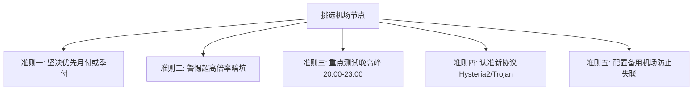

# 2026年高性价比机场推荐与Clash节点选购指南：从免费公益节点到稳定梯子工具避坑测评

在寻找科学上网与翻墙方案时，几乎所有用户都会面对海量的信息干扰：有人在群里分享**“免费公益机场”**和几十条随时失效的**“免费机场节点”**；有人在论坛打听**“有没有便宜稳定的性价比机场”**；也有人在纠结各种各样的 **“Clash 梯子工具”** 到底哪个速度快、不卡顿。

那么，究竟什么样的机场才能被称为真正的高性价比机场？免费公益机场到底能不能当日常主力用？如何挑选一家晚高峰不降速、稳定不跑路的好用机场？本文将通过长期真实实测，为你带来 2026 年最新最深度的**高性价比机场测评与 Clash 节点选购避坑全攻略**。

---

## 什么是真正的高性价比机场？（打破“低价等于性价比”的误区）

很多刚刚接触翻墙的新手用户，往往把“性价比”简单粗暴地等同于“价格便宜”，甚至去买所谓的“1元包月”或“5元包年”机场。然而使用两三天后就会发现：
- 晚上 8 点到 11 点黄金时段，网页转圈打不开，YouTube 连 720P 都缓冲卡顿；
- 节点动不动集体红线超时，提交工单无人搭理；
- 甚至刚买不到半个月，机场主就关闭网站“卷款跑路”。

::: tip 什么是真正的高性价比？
**高性价比 = 合理的价格 × 极其稳定的晚高峰体验 × 丰富可靠的节点线路 × 健全的售后支持**
在 2026 年，真正优秀的高性价比机场，月费通常在 **8 元至 20 元之间**。它们不仅采用优质的 **BGP 多线中转** 或 **IEPL 内网专线**，更能保证晚高峰期间 YouTube 4K 秒开、稳定解锁 Netflix/Disney+ 流媒体与 ChatGPT/Claude 等 AI 生产力工具。
:::

### 机场线路架构与体验对比表

为了帮助大家快速看懂机场节点参数，我们整理了目前主流机场的三类线路架构对比：

| 线路类型 | 成本与定价 | 晚高峰稳定性 | 抗网络封锁能力 | 推荐指数 |
| :--- | :--- | :--- | :--- | :--- |
| **普通直连线路** | 极低（月付 ¥1~5） | 经常丢包卡顿，晚高峰断流 | 极差，敏感期经常全军覆没 | ⭐⭐ |
| **BGP 智能中转** | 中等（月付 ¥8~18） | 延迟适中，三网优化，速度平稳 | 优秀，国内入口多重冗余 | ⭐⭐⭐⭐⭐（最高性价比） |
| **IEPL / IPLC 专线** | 偏高（月付 ¥20~40+） | 极低延迟，零丢包，无视网络波动 | 顶级，内网不过国家防火墙 GFW | ⭐⭐⭐⭐⭐（高端首选） |

---

## 免费公益机场与免费机场节点深度评测：真的能当主力吗？

在 Telegram 群组、GitHub 仓库以及各类论坛中，经常能看到有人发布**“免费公益机场”**、**“每日更新免费节点”**或**“长期公益梯子工具”**。很多朋友会问：既然有免费的，为什么还要花钱买付费机场？

我们对市面上常见的公益机场进行了长达数月的追踪测试，总结出三大致命痛点：

### 1. 严重的隐私与安全风险（最致命）
天下没有免费的午餐。搭建和维护高带宽海外服务器每个月都需要数千甚至数万元的真实资金成本。部分不良免费公益机场通过以下手段牟利：
- **中间人嗅探与日志记录**：记录并分析用户的上网行为、访问记录，甚至尝试劫持明文传输的账号信息；
- **插入恶意重定向广告**：在用户访问网页时悄悄注入暗刷流量或恶意挖矿脚本。

### 2. 节点拥挤与“寿命以小时计”
公开发布的免费机场节点往往会有数千甚至上万人同时连接。服务器带宽瞬间被占满，导致：
- 连接延迟动辄 500ms~1500ms 以上，丢包率高达 40% 以上；
- 节点由于被防火墙高频探测，往往存活不到半天就会被封锁失效，用户需要每天花费大量时间到处寻找新节点。

### 3. 关键时刻掉链子
遇到重要工作会议、学术资料查阅、或者每年固定的网络封锁敏感期时，免费公益机场往往无一例外全军覆没。

::: important 结论与建议
**免费公益机场只适合作为应急备用工具！** 
如果你需要稳定的办公、查阅资料、观看 4K 流媒体或使用 AI 大模型，强烈建议配置一个主力付费机场，最低仅需每月一包烟钱，就能换来数月顺畅无忧的上网自由。
:::

---

## 2026年高性价比 Clash 机场与梯子工具精选推荐

基于本站团队对 30 余家知名机场长达数月的延迟监测、晚高峰吞吐量压测及跑路风险评估，以下几家机场在**性价比、速度与稳定性**上表现尤为亮眼：

### 1. 极连云 — 专线中转性比价天花板
- **定位**：追求性价比与稳定兼顾的首选梯子工具。
- **线路特色**：全节点采用国内多入口 BGP 智能中转与优质 IPLC 专线，三网（电信、联通、移动）自动匹配最优回国路由。
- **解锁支持**：完整解锁 Netflix、Disney+、YouTube Premium、TikTok、ChatGPT 以及 Claude 3.5。
- **套餐门槛**：月付低至 ¥10 起，支持多设备同时在线，不限制连接速度。
- **适用人群**：学生党、外贸工作者、日常影音追剧与轻量 AI 用户。

### 2. 瞬云机场 — 稳定老牌与多协议支持
- **定位**：技术底蕴深厚的老牌机场，抗封锁能力极强。
- **线路特色**：主力节点全面升级支持 **Hysteria 2** 与 **Trojan** 新型协议，即使在弱网环境和移动 4G/5G 网络下依然能保持超低丢包。
- **测速表现**：晚高峰 21:00 实测 YouTube 4K 播放速率稳定在 150,000 Kbps 以上，拖动进度条无任何卡顿。
- **套餐价格**：季度起付折合月均仅十几元，性价比极具竞争力。

### 3. 光年梯 — 大流量大带宽的高速节点
- **定位**：适合重度下载用户、海量 4K 视频爱好者及远程办公团队。
- **线路特色**：配备高达 2.5Gbps 的独立大带宽节点，支持多设备共享，全天候不限速。
- **特色保障**：承诺全天候客服工单在线，节点故障 10 分钟内自动调度切换。

👉 查看更多完整测评与优惠折扣：**[2026年便宜好用VPN机场推荐排行榜](/airport/)**

---

## 选购 Clash 机场节点的五大黄金准则（避坑技巧）

在挑选适合自己的机场梯子时，牢记以下 5 点可以帮你避开 90% 的暗坑：

1. **坚持“月付或季付”，拒绝大额长周期诱惑**：哪怕机场给出“买一年送一年”的巨额优惠，也不要轻易年付。网络大环境多变，月付或季付能将风险降到最低。
2. **看清节点的“倍率计算”**：很多所谓便宜机场标称 1000G 流量，但所有节点都是 3x 甚至 5x 倍率，实际能用的流量直接缩水一大半！正规高性价比机场绝大多数节点应为 1.0x 正常倍率。
3. **重点实测晚高峰（20:00 - 23:00）**：白天由于骨干网空闲，几乎所有机场都能跑满速度；只有在晚上大家都在用网的拥堵时段，才能检验出机场真正的线路带宽实力。
4. **关注协议升级**：2026 年尽量选择支持 **Hysteria 2**、**VLESS-Reality** 或 **Trojan** 的机场，老旧的 SS/SSR 纯明文或旧加密协议在敏感时期极易受到干扰。
5. **准备双订阅备用策略**：常在河边走，怎能不备伞。建议准备一个按量付费或几元钱的廉价备用机场，详见 [备用机场双订阅防失联策略](/proxy/backup-airport-guide.html)。

---

## Clash 客户端导入机场节点保姆级配置指引

目前 Windows、macOS 和 Android 上最推荐的科学上网客户端是基于开源内核的 **Clash Verge Rev** 或 **Clash Meta (Mihomo Party)**。以下是一键导入配置步骤：

### 1. 复制机场订阅地址
登录你的机场用户中心后台，在仪表盘找到 **“复制 Clash 订阅”** 或 **“复制通用订阅链接”**，点击复制到剪贴板。

### 2. 导入到 Clash 客户端
1. 打开 **Clash Verge Rev** 客户端；
2. 点击左侧菜单栏的 **「订阅 / Profiles」**；
3. 将复制好的订阅链接粘贴进顶部的输入框中；
4. 点击右侧的 **「导入 / Import」** 按钮，客户端会自动下载所有海外节点列表并显示成功绿标。

### 3. 选择节点与开启代理
1. 点击左侧菜单栏的 **「代理 / Proxies」**；
2. 建议将规则组选择为 **「规则 / Rule」** 模式（实现国内直连、国外代理）；
3. 点击右上角的 **「测速」**（闪电或 WiFi 图标），所有节点会显示当前连接延迟；
4. 点击选中延迟较低、标有专线或低倍率的节点；
5. 返回主界面，打开 **「系统代理 / System Proxy」** 开关，即可顺利开启全球自由浏览！

---

## 常见问题与答疑（FAQ）

### Q1：为什么同一家机场的节点，电信用户非常顺畅，而移动宽带用户经常卡顿？
这是国内不同运营商出海骨干网互联架构决定的。中国电信拥有成熟的 163 与 CN2 骨干网，而中国移动出海常常需要跨网路由或者经过拥挤的移动 CMI 链路。如果你是移动宽带用户，建议选择配备 **BGP 多线智能接入** 或 **专门对移动网络做过优化中转** 的机场。详细原理解析请阅读 [三大运营商翻墙速度差异深度剖析](/proxy/isp-speed-differences.html)。

### Q2：苹果 iPhone 手机如何使用这些 Clash 机场节点？
苹果 iOS 系统目前不支持直接安装原版 Clash 客户端。你可以使用专为 iOS 打造的代理神器 **Shadowrocket（小火箭 / 暗影火箭）**。绝大多数机场后台均提供“一键导入 Shadowrocket”功能，详细图文教程可参考：
- [2026暗影火箭(影子火箭/Shadowrocket)官网正版下载与共享账号获取指南](/proxy/shadowrocket-official-download.html)
- [小火箭免费共享账号网站每日更新](/airport/apple-id-shared.html)

---

## 总结

选择一款称心如意的科学上网梯子工具并不复杂。远离所谓的超低价圈钱跑路陷阱，理性看待免费公益节点，选择一家线路靠谱、口碑扎实、月付实惠的高性价比机场，配合 Clash 或 Shadowrocket 客户端，就能以最低的时间与金钱成本，享受到极致流畅的全球互联体验。

**更多相关推荐阅读：**
- [2026年稳定便宜好用VPN机场评测排行榜](/airport/)
- [2026年梯子推荐：机场梯子与传统VPN深度对比](/proxy/tizi-guide-2026.html)
- [新手必备：什么是翻墙与Clash进阶配置](/proxy/fanqiang-guide.html)
- [流媒体与ChatGPT账号合租指南：银河录像局与账号星球测评](/account/platforms.html)
