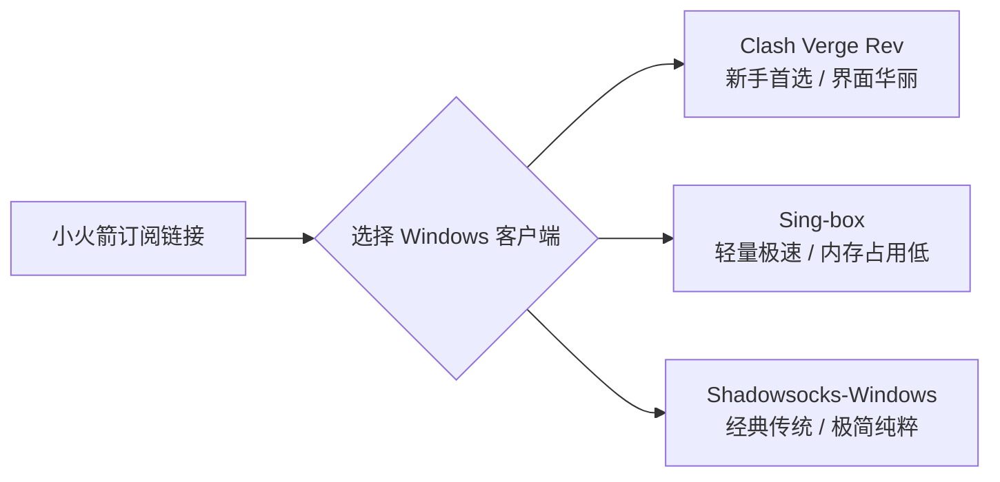

# Shadowrocket Windows 电脑版下载与安装配置教程：Shadowsocks Windows / Clash Verge 替代全指南

在 iOS 苹果移动端，**Shadowrocket（小火箭）** 毫无疑问是第一梯子代理工具。许多用户在习惯了小火箭简单高效的操作后，经常会在 Google 或百度中搜索 **“Shadowrocket Windows”**、**“Shadowrocket 电脑版”** 或 **“Shadowsocks Windows”**，试图在 Windows PC 上下载和小火箭界面一模一样的客户端。

然而，市场上关于 **Shadowrocket Windows 官网下载** 的搜索结果鱼龙混杂，不少站点挂羊头卖狗肉，甚至诱导用户下载捆绑病毒软件。本文将为你系统澄清 **Shadowrocket 在 Windows 系统的真实情况**，并提供目前最完美、最流畅的 PC 端翻墙替代配置方案！

---

## ❓ 官方解答：Shadowrocket 有没有原生 Windows 电脑版？

**明确答案：Shadowrocket（小火箭）官方从未开发过原生 Windows 版本的软件！**

1. **开发者独占平台**：Shadowrocket 由 *Shadow Launch Technology Limited* 开发，仅在 Apple App Store 上架，原生支持 **iOS、iPadOS 以及搭载 Apple Silicon（M1/M2/M3/M4）芯片的 macOS**。
2. **警惕假冒 Shadowrocket Windows 官网**：网上凡是标榜“Shadowrocket 电脑版正版下载”、“小火箭 Windows 破解版”、“Shadowrockets Windows 官网”的独立网站，**全部为第三方假冒引流站点或钓鱼木马软件**！请勿下载安装！
3. **Shadowsocks ≠ Shadowrocket**：
   - **Shadowsocks（SS/影袜）** 是一种开源的翻墙代理协议；
   - **Shadowrocket（小火箭）** 是 iOS 平台支持 SS/SSR/V2Ray/Trojan/Hysteria 等多种协议的客户端。
   - Windows 上的开源客户端叫 **Shadowsocks-Windows**，与 Shadowrocket 不是同一个软件，但它们可以共享同一个机场订阅节点。

---

## 🛠️ 方案一：在 Windows 运行 Shadowrocket 的唯一方法（WSA / 虚拟机）

如果你一定要在 Windows PC 上使用真正的 Shadowrocket 界面，可以通过以下两种方式实现：

### 1. 使用 Windows Subsystem for Android (WSA) 安卓子系统
Windows 11 支持 WSA 运行 Android 应用。由于 Shadowrocket 也有少数第三方打包的 Android 测试版或 APK，可通过 WSA 侧载运行。但配置繁琐、性能损耗较大，通常不作为日常首选。

### 2. 在 macOS (M系列芯片) 运行小火箭
如果你的电脑是 Apple Silicon M 芯片（如 MacBook Pro/Air），可以在 Mac App Store 中直接下载 iOS 版 Shadowrocket，以原生 Mac 应用形式无缝运行。

---

## 🚀 方案二：Windows 电脑最佳 3 款小火箭替代工具（极力推荐）

对于 99% 的 Windows 电脑用户，最明智的选择是使用 Windows 平台上功能更强大、性能更卓越的原生科学上网客户端。它们能**无缝兼容你的小火箭机场订阅链接**！

### 1. Clash Verge Rev（Windows 平台最推荐 ⭐⭐⭐⭐⭐）
**Clash Verge Rev** 是目前替代 Clash for Windows 的新一代开源神器，界面现代美观，原生支持中文，且内核完全兼容最新的 Hysteria2 和 VLESS 协议。

- **优势**：支持一键导入小火箭订阅、智能分流、节点延迟测试、开机自启与 TUN 虚拟网卡模式（游戏全局加速）。
- **下载与教程**：参考本站 [Windows 端 Clash Verge 保姆级配置教程](/airport/client-windows.html)。

### 2. Sing-box Windows（高性能专业选择 ⭐⭐⭐⭐）
**Sing-box** 是由独立团队维护的新一代通用网络代理引擎，性能极其强悍，网络延迟极低。

- **优势**：支持 AnyTLS、Hysteria2 等最新防护协议，资源占用极小。
- **适合人群**：对电脑性能与网络响应时间有极致要求的用户。

### 3. Shadowsocks-Windows（经典极简工具 ⭐⭐⭐）
如果你只需要最基础的 Shadowsocks / SSR 协议代理，经典的 **Shadowsocks-Windows (SS-Win)** 仍然是最简单的选项。

- **优势**：绿化免安装，打开即用，只提供系统代理开关。
- **下载渠道**：需前往 GitHub `shadowsocks/shadowsocks-windows` 官方 Release 页面下载正版。

---

## 📥 如何把小火箭订阅链接导入 Windows 客户端？

你在小火箭里使用的机场订阅链接，在 Windows 端同样可以 **1 秒快速复用**：

1. **复制订阅链接**：打开你所购买的机场（如 [极连云](/airport/jilianyun.html) 或 [瞬云](/airport/shunyun.html)）用户后台，点击 **“复制 Clash / 通用订阅链接”**。
2. **导入 Clash Verge Rev**：
   - 打开 Clash Verge Rev 客户端；
   - 点击左侧导航栏 **「订阅 (Profiles)」**；
   - 在顶部 URL 输入框中粘贴订阅链接，点击 **「导入 (Import)」**；
   - 导入成功后选中该配置文件，在 **「代理 (Proxies)」** 中选择合适的海外节点即可开启翻墙！
3. **免费获取共享账号与工具**：
   - 如需在 iOS 端体验小火箭，可前往 [小火箭共享账号网站与免费美区 ID 专区](/airport/apple-id-shared.html) 获取正版已购账号。

---

## 📖 延伸阅读与相关资源

- 🚀 [暗影火箭(Shadowrocket)官网正版下载与共享账号全指南](/proxy/shadowrocket-official-download.html)
- 📱 [小火箭共享账号网站：2026 免费美区 Apple ID 每日更新](/proxy/xiaohuojian-gongxiang-zhanghao.html)
- ✈️ [2026年最新梯子推荐：机场梯子 vs VPN 梯子全方位对比](/proxy/tizi-guide-2026.html)
- 💰 [高性价比机场与 Clash 梯子选购避坑指南](/proxy/cost-effective-airport-guide.html)
- 💻 [Windows 端 Clash Verge 详细配置与使用教程](/airport/client-windows.html)
