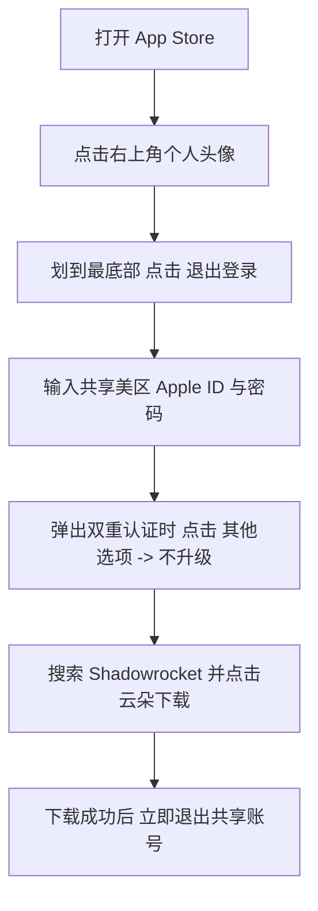

在 iOS 苹果设备上，**小火箭 (Shadowrocket)** 是公认功能最强大、使用最顺手的科学上网代理客户端。由于 Shadowrocket 未在国区 App Store 上架，用户必须使用海外区域（如美区、港区、台区）的 Apple ID 才能下载。

为了方便没有海外 Apple ID 的新手用户，市场上衍生出了许多 **“小火箭共享账号网站”**。本文为您整理 2026 年最新安全有效的小火箭共享账号获取途径、正确登录下载避坑步骤，以及节点配置教程。

---

::: danger ⚠️ 登录共享 Apple ID 必须严格遵守的【保命安全红线】
1. **绝对禁止在 iPhone/iPad 的【设置 (Settings)】中登录共享账号！**
   只能在 ** App Store ** 内登录！如果在系统设置中登录了陌生人的 Apple ID，一旦账号被黑客修改密码锁定，您的手机将被远端锁死变砖并被勒索钱财！
2. **下载完 Shadowrocket 后，必须第一时间退出共享账号！**
   换回您自己的个人 Apple ID，切勿将共享账号当成个人日常账号使用。
:::

---

## 🌐 2026 最新小火箭共享账号网站与获取途径

我们为您精选了更新频繁、验证可靠的免费美区 Apple ID 共享获取渠道：

| 渠道名称 | 说明与获取方式 | 免费包含服务 | 安全系数 |
| :--- | :--- | :--- | :--- |
| **本站免费 Apple ID 共享专区** | [点击直达本站共享账号列表](/airport/apple-id-shared.html) | 免费已购 Shadowrocket 账号 | ⭐⭐⭐⭐⭐ (本站定期人工维护) |
| **小火箭免费共享网** | 提供实时更新的美区/台区已购账号卡密 | 包含已购 Shadowrocket | ⭐⭐⭐⭐ |
| **发卡网/独享买号** | 几元钱购买个人独享美区 Apple ID | 独立使用不锁卡 | ⭐⭐⭐⭐⭐ (最推荐) |

---

## 📱 小火箭免费下载 4 步正确登录教程

请严格按照以下步骤操作，确保 100% 安全：

### 图文步骤拆解：

1. **第一步：打开 App Store**
   找到 iPhone 上的 **App Store** 应用（注意：不是系统设置！）。点击右上角的**个人头像图标**。

2. **第二步：退出原有账号**
   拉到页面最底部，点击红色字样的 **【退出登录】(Sign Out)**。

3. **第三步：登录共享账号**
   在顶部账号密码框中，输入复制好的美区共享 Apple ID 与密码，点击**登录**。
   *若提示“Apple ID 安全/双重验证”，请务必选择 **【其他选项】->【不升级账户安全】**，切勿绑定您自己的手机号！*

4. **第四步：搜索并下载 Shadowrocket**
   在搜索框中输入 `Shadowrocket`，找到图标为“小火箭”的应用，点击下载（已购买过的账号直接点击云朵图标）。

5. **第五步：立即退出**
   下载完成后，重复第一步，拉到最底部点击**退出登录**，恢复您自己的个人 App Store 账号。

---

## 🚀 下载完小火箭后如何配置节点？

有了小火箭客户端后，您还需要配合稳定高速的翻墙机场订阅节点才能上网：

1. 打开 [2026年稳定安全VPN机场推荐一览表](/airport/)。
2. 注册并购买任意性价比机场（如 [极连云](/airport/jilianyun.html) 或 [光年梯](/airport/guangnianti.html)）。
3. 在机场控制台找到 **“一键导入 Shadowrocket 订阅”** 按钮点击导入。
4. 打开小火箭，勾选节点，将全局路由改为 **【配置 (Config)】**，开启顶部开关即可极速翻墙！

---

## 📖 相关教程与延伸阅读

- 🍏 [本站免费共享 Apple ID 实时更新页面](/airport/apple-id-shared.html)
- 🚀 [Shadowrocket 官方正版下载与独享账号获取指南](/proxy/shadowrocket-official-download.html)
- 📱 [小火箭 Shadowrocket 保姆级使用与分流配置教程](/proxy/xiaohuo-jian-guide-2026.html)
- ✈️ [2026年常用稳定机场推荐排行榜](/airport/best-airport-2026.html)
